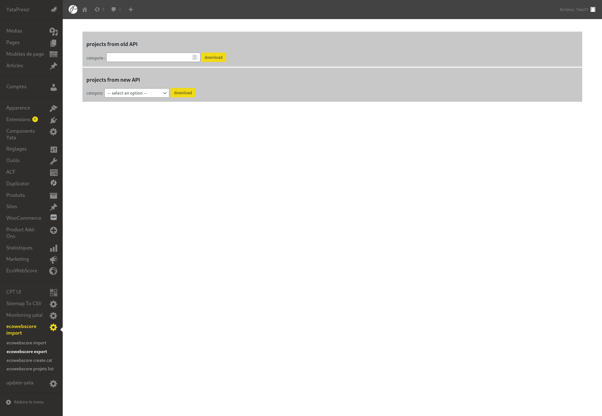
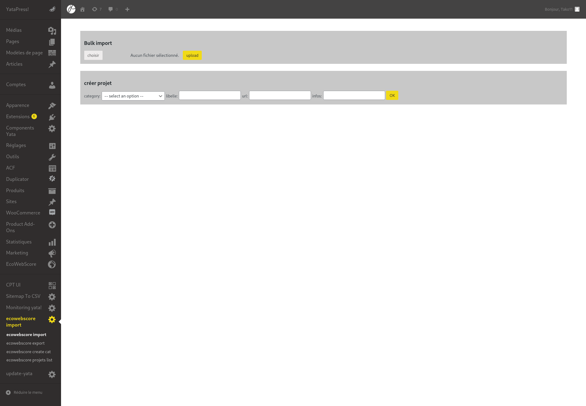
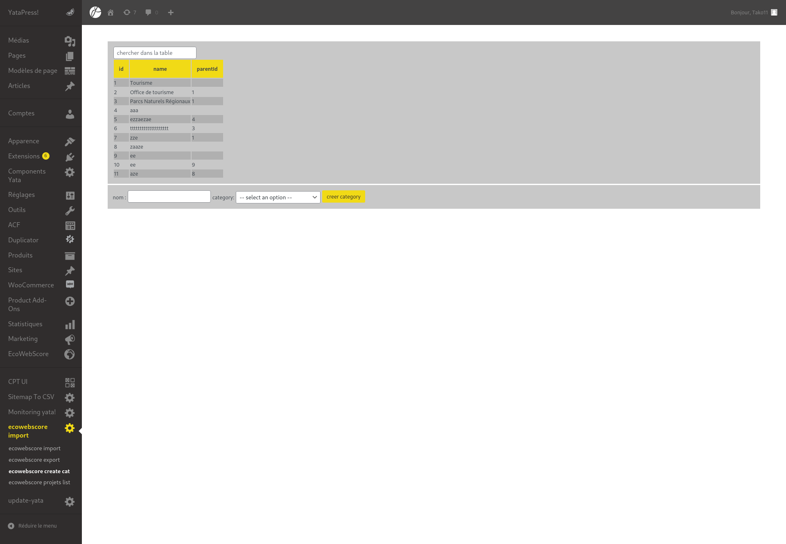
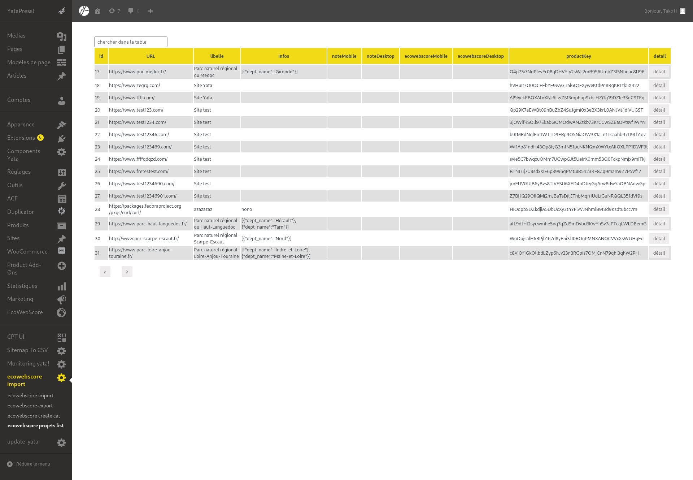
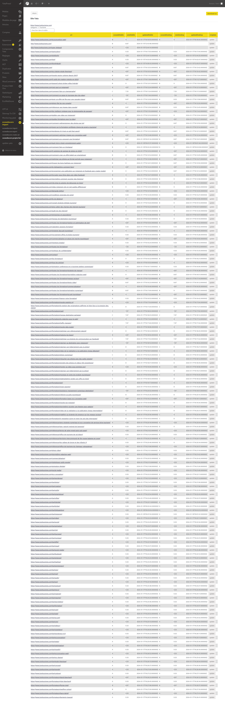
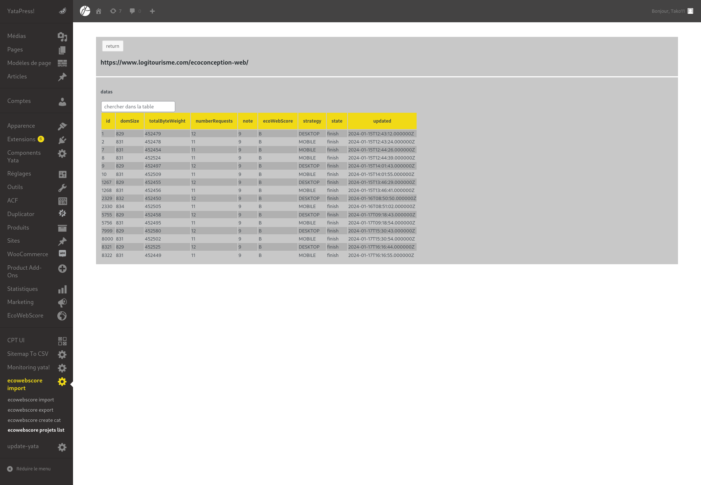

# création de pages admins dans un site wordpress
fournit une interface graphique pour une API

## ecowebscore
permet de classer les sites internet en fonction de leurs efficacité et leur donne une note
quel quantité de données est téléchargé pour afficher la page combien de requêtes sont faite ...

## export données en CSV en fonction du numéro catégorie fournie

obtiens de l'API les projets avec une catégorie fournie
crée un fichier CSV avec une partie des informations

## import de données à partir d'un CSV ou juste création d'un projet

importation de projet(s) en utilisant un fichier CSV formaté de la meme façon que le CSV créé lors de l'export 
ou un simple formulaire pour ajouter un nouveau projet

## liste des catégories et permet d'en rajouter

liste les catégories renvoyé par l'API
permet d'ajouter une nouvelle catégorie

## liste des projets, détail du projet(et export de données en CSV), détail sur une URL du projet

### page 1

liste des projets par groupe de 15 (l'API les fournis de cette façon)
permet d’accéder au détail d'un projet
### page 2

liste toute les URL du projets avec leur efficacité, leur derniere date d'analyse, et permet de demander une nouvelle analyse 
permet d'exporter les données du projet pour analyse

### page 3

l'historique d'analyse de l'URL
